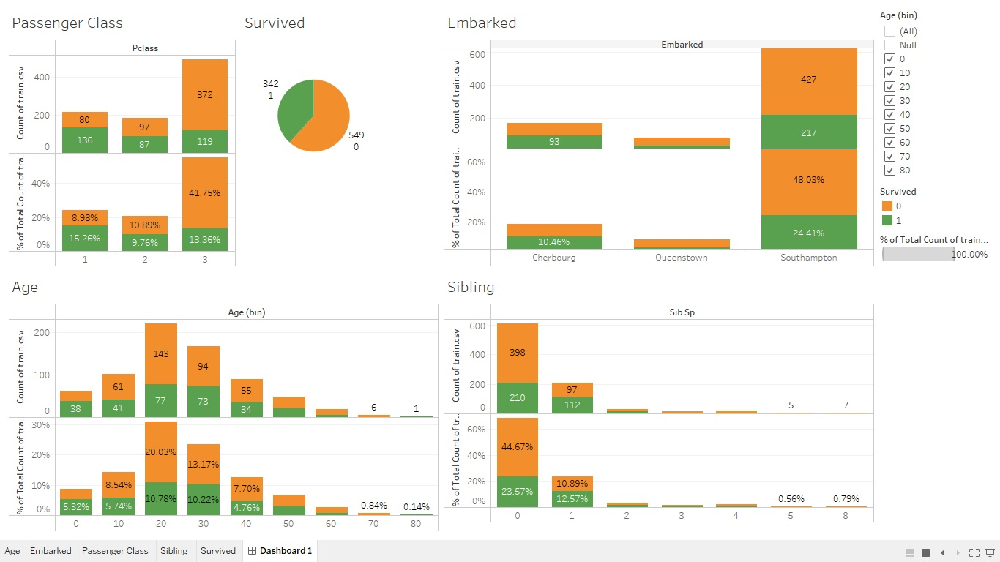

# Omkar-More-Portfolio
Analytics Portfolio

## Project 1: Titanic Dataset Data Visualization
This is a personal project where I visualized Titanic Dataset to identify some insights into the dataset.

-Data was taken from Kaggle Titanic Dataset.
This data set has information about the passengers who boarded the Titanic along with other information like Passenger Ages, survival information.

The visualization shows information about the survival information based on their age distribution, passenger classes and their survival rates, the number of passenger that survived based on their embark location, the survival rates based on siblings and spouse data.

### Overview/Insights on Titanic Data - Dashboard Snippet
Also You can find the Tableau Public Workbook [Titanic Data Visualization Link - Click Here](https://public.tableau.com/app/profile/omkar.more3781/viz/TitanicDataVisualization_16464837715320/Dashboard1) 

